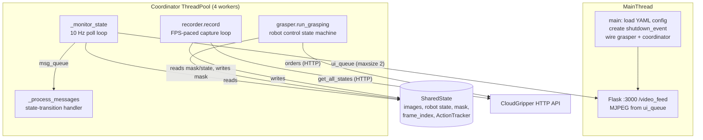
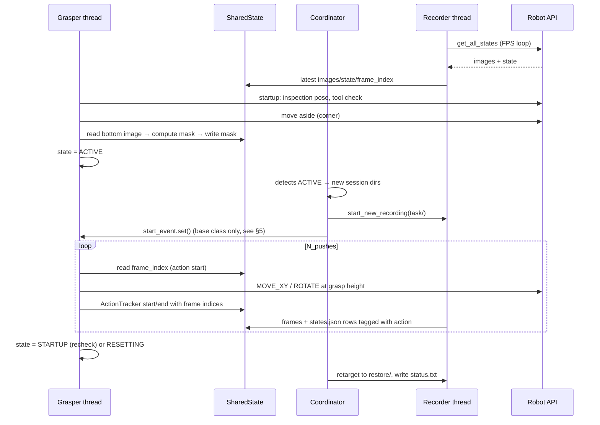

# Current Architecture — Granular-Manipulation Data Collection

*Baseline description of the system as it exists on branch `backgammon` (July 2026), traced from
`autograsper/main_chickpeas.py`. This document is the reference for the refactor designs in
[02_proposed_architecture.md](02_proposed_architecture.md) and
[03_segmenter_native_design.md](03_segmenter_native_design.md).*

> **Repo state caveat.** The code is mid-refactor (abandoned some months before this writing).
> Several referenced files do not exist and some imports are broken. Where that happens, this
> document describes the *intent* reconstructed from the surrounding code. Names of the form
> `GranularPusher` / `SegGranularPusher` refer to the class actually implemented as
> `RandomPushGrasper` in `custom_graspers/granular_pusher.py` (a rename was planned but not done).

---

## 1. Purpose of the system

Collect a dataset of **planar pushes of granular material** (chickpeas) performed by a CloudGripper
robot (x, y, z, in-plane rotation + parallel-jaw gripper) holding a **rigid flat thin tool**.
Each episode records synchronized top/bottom camera frames, robot states, executed orders, action
boundaries (start/end frame of every motion), and occupancy masks of the granules.

The downstream target format (see `MD files/transition_dataset_design.md` and
`extract_transitions.py` / `segment_transitions.py` / `run_transition_pipeline.py`) is a
**transition dataset**: `(mask_before, tool_start_px, tool_stop_px, angle) → mask_after`, matching
the simulation dataset `PileSweepData` so a dynamics model can train on real and simulated data
interchangeably.

Two entry points exist for the same task:

| Entry point | Perception assumption | Grasper class |
|---|---|---|
| `main_chickpeas.py` | **No trusted segmenter.** Occupancy mask from background subtraction against a reference "empty plate" image. The robot occludes the scene, so it must **move aside** before every mask capture. | `RandomPushGrasper` (`custom_graspers/granular_pusher.py`) |
| `main_chickpeas_segmenter.py` | **Trusted YOLOv11 segmenter** (`ChickpeaSegmenter`) that tolerates the robot in view; masks are computed continuously in a background thread. | `SegGranularPusher` from `custom_graspers/segmenting_granular_pusher.py` — **file missing**; the intended class was never committed. `recording_seg.py` (the segmenting recorder) *does* exist. |

## 2. Process/thread topology

`main_chickpeas.py` builds everything, then serves an MJPEG debug stream.



Key structural facts:

- **Two independent `GripperRobot` connections** to the same physical robot: the grasper's
  (commands) and the recorder's (observation polling via `get_all_states`). They are unaware of
  each other; synchronization happens only through wall-clock sleeps.
- `SharedState` (defined in `coordinator.py`) is the single blackboard shared by all threads:
  `latest_top_image`, `latest_bottom_image`, `latest_robot_state`, `latest_mask` (+
  `latest_mask_saved` flag), `timestamp`, `frame_index` (+ locks), and the `ActionTracker`.
- `shutdown_event` is the global abort channel. Any component that hits an unrecoverable error
  sets it; everyone else polls it.

## 3. Component responsibilities

### 3.1 `main_chickpeas.py` (composition root + UI)
- Loads `chickpeas-config.yaml` (**missing from repo**; the closest existing file is `config.yaml`,
  which lacks the `camera.H`, `robot`, `fence`, `tool_detection`, `Granuler_detection` sections the
  code reads — the real config lived outside version control).
- Creates `RandomPushGrasper(config, shutdown_event, N_pushes=10)` and
  `DataCollectionCoordinator(config, grasper, shutdown_event, visualize=True)`.
- Runs Flask, streaming the bottom camera image from `coordinator.get_ui_update()`.
- Installs a `threading.excepthook` that prints the traceback and hard-exits.

### 3.2 `coordinator.py` — `DataCollectionCoordinator`
Orchestrates recording around the grasper's activity state. Three loops:

1. **`_monitor_state`** (10 Hz): posts `{"type": "state_update", "state": grasper.state}` to
   `msg_queue` every tick (whether or not it changed); services `record_current_state()` snapshot
   handshakes (increments `recorder.take_snapshot`, waits on `snapshot_cond`); pushes bottom
   frames to `ui_queue` (drops oldest when full); mirrors `shared_state.latest_robot_state` into
   `grasper.robot_state` (flagged in a comment as a pre-`SharedState` legacy racing hazard);
   triggers `gc.collect()` every 5 s; shows a cv2 window when `visualize=True`.

2. **`_process_messages`**: consumes `state_update` messages, fires `_on_state_transition` when
   the state changed:
   - `→ ACTIVE`: create a new session directory tree, point recorder at `<session>/task/`,
     `recorder.start_new_recording()` (resets frame counter, clears ActionTracker), then set
     `grasper.start_event` releasing the grasper.
   - `→ RESETTING`: write `status.txt` (`success`/`fail`) at session level, retarget recording to
     `<session>/restore/`.
   - `→ STARTUP`: `recorder.disable_recording()`, pause the recorder for
     `timeout_between_experiments` seconds.
   - `RESETTING → *`: `recorder.save_action_summary()`.
   - `→ FINISHED`: `recorder.stop()`, exit loop.

3. **Recorder thread** — created lazily on first need (`_ensure_recorder_running`), one instance
   for the entire run; only its output directory is retargeted between sessions.
   Constructor chooses `recording.Recorder` or `recording_seg.Recorder` depending on whether a
   `segmenter` was injected.

Data layout produced per session (`FileManager.get_session_dirs`):

```
autograsper/recorded_data/<experiment_name>/<n>/
├── status.txt                  # "success" | "fail"
├── task/                       # recording during ACTIVE
│   ├── Images/image_top_<f>.jpeg
│   ├── Bottom_Images/image_bottom_<f>.jpeg   (+ image_bottom_raw_<f>.jpeg optional)
│   ├── Masks/mask_<f>.jpeg     (.npy in the seg recorder)
│   ├── states.json             # per-frame robot state + timestamp + action metadata
│   ├── actions.json            # ActionTracker summary (start/end frame per action)
│   └── orders.json             # raw orders as sent (written by execute_order)
└── restore/                    # same structure, recorded during RESETTING
```

### 3.3 `recording.py` — `Recorder`
FPS-paced loop (`fps` from config, e.g. 2.5):

1. `_update()`: one HTTP `get_all_states()` call → top image, raw bottom image, robot state,
   timestamp. Applies fisheye undistortion + homography rectification to the bottom image
   (`camera.m`, `camera.d`, `camera.H`), applies the per-robot `rotation_bias` correction to the
   reported rotation (mod 180), then publishes everything into `SharedState`. This makes the
   recorder the system's **only observation source** — the grasper never fetches images itself
   (except one legacy `get_image_top()` in `perform_grab_tool`).
2. If recording is due (continuous mode, or a snapshot was requested in
   `record_only_after_action` mode): `_capture_frame()` writes images (and the current
   `shared_state.latest_mask` once per new mask, guarded by `latest_mask_saved`), publishes
   `frame_counter → shared_state.frame_index` (this is how the grasper learns frame indices for
   action boundaries), then `save_state()` appends to `states.json` (attaching the ActionTracker
   action covering this frame, if any).
3. Gating flags: `disk_enabled` (off during STARTUP), `pause` (used during between-experiment
   timeout), `stop_flag`.

`recording_seg.py` is a copy of `recording.py` plus:
- **`SegmentationThread`** (daemon): whenever `shared_state.timestamp` changes, center-crops the
  bottom image to 360×360, runs `segmenter.predict(..., return_format='combined')`, writes the
  binary mask to `shared_state.latest_mask` and clears `latest_mask_saved`. This gives a
  **continuously fresh mask** without moving the robot.
- Masks saved as `.npy` instead of `.jpeg`.

### 3.4 `grasper.py` — `AutograsperBase`
Abstract robot-behavior base class. Provides:

- Its own `GripperRobot` connection; config-driven `time_between_orders`,
  `record_only_after_action`, `robot_idx`.
- **Activity state machine** (`RobotActivity`: `STARTUP → ACTIVE → RESETTING → STARTUP …`,
  terminal `FINISHED`) driven by `run_grasping()`. The base implementation waits for the
  coordinator's `start_event` before each `perform_task()`. Subclass hooks: `startup()`,
  `perform_task()`, `reset_task()`, `recover_after_fail()`.
- **`queue_orders(order_list, …)`** — the main actuation path. For each `(OrderType, values)`
  tuple: capture `shared_state.frame_index`, open an `ActionTracker` action (skipped for gripper
  orders), call `library/utils.py::execute_order` (clips values to [0,1], int-casts rotation,
  applies `self.rotation_bias` if present, sends the HTTP command, appends to `orders.json`),
  sleep `time_between_orders`, close the action with the current frame index, and optionally
  perform the `record_current_state()` snapshot handshake.
- **Action tracking helpers** wrapping the shared `ActionTracker` (`action_tracker.py`): each
  action stores type, phase (TASK/RESET/STARTUP), start/end frame, start/end robot state,
  `is_planar_2d` (true for MOVE_XY/ROTATE — the pushes the transition dataset cares about), and
  detail dict. `ActionTracker` supports **one in-flight action at a time**.

### 3.5 `custom_graspers/granular_pusher.py` — `RandomPushGrasper` (the actual planner+policy)
This class is simultaneously the *planner*, the *perception client*, the *safety layer*, and the
*episode state machine*. It **overrides `run_grasping`** with its own loop (it does not use the
base one, and does not wait for `start_event` — see §5):

```
while not shutdown:
    STARTUP  → startup(): tool-grip check (+ human-assisted regrasp loop),
               mask refresh, decide → ACTIVE or RESETTING
    ACTIVE   → perform_task(): ensure tool placed in a granule-free spot,
               N random planar pushes; then → STARTUP (re-check before next episode)
    RESETTING→ reset_task(): sweep granules away from walls back to center; → ACTIVE
```

Sub-behaviors, in intent terms:

- **`startup()`** — *"is the system ready to push?"*
  1. Move to a fixed inspection pose; `check_tool_grip()` does a color-threshold analysis of a
     top-camera ROI (`tool_user_utils.analyze_tool_grip`) to verify the tool is held correctly.
  2. If grip quality is below threshold: release the tool and enter a **human-intervention loop**
     — wait 60 s, warn by closing/opening the gripper, then `perform_grab_tool()` (blind scripted
     grasp from a fixed tool-rack position `(0.03, 0.49)`, z 0.27), re-check, repeat.
  3. `update_mask_and_process()` (below); abort if no granules detected.
  4. `check_reset_needed(mask)` (`object_tracker/granular_utils.py`): if <30 % of granule mass is
     inside the central workspace region → `RESETTING`, else `ACTIVE`.

- **`update_mask_and_process()`** — *the "cautious perception" core.* Because background
  subtraction can't distinguish robot from granules, the robot first raises Z and drives to the
  corner `(0.0, 1.0)`, out of the bottom camera's view. Then it takes
  `shared_state.latest_bottom_image` and runs `granular_utils.process_image`: crop around
  `crop_center=(275, 200)` size 360×360 → color-difference vs. the reference empty-plate image →
  reject robot-colored (primary colors) and background-colored pixels → morphological cleanup +
  connected-component filtering → binary occupancy mask + clump stats. The
  `interaction_since_last_mask` flag makes the (expensive, motion-requiring) refresh lazy: masks
  are recomputed only after the tool has touched the scene.

- **`perform_task()`** — *one data-collection episode.*
  1. Refresh mask if needed; raise to clearance height.
  2. If the tool is raised, find a **granule-free tool placement**:
     `fence_utils.find_tool_placements` scans the mask's distance transform with a rotated
     rectangular tool footprint over candidate angles inside the image-space manipulation
     boundary, returning the best-clearance pose — this is the *"don't press the tool down onto
     chickpeas"* safety rule. Convert px→robot via homography (`PixelRobotTransform`, matrix from
     `homography.npz`), move there, rotate, lower to `grasp_height` (0.34).
     If no free placement exists, sweep a random wall first to clear space.
  3. Queue `N_pushes` random `(MOVE_XY, ROTATE)` pairs uniform in the manipulation boundary —
     the actual dataset-generating pushes, executed at grasp height as planar motions.
  4. Set `interaction_since_last_mask = True`.

- **`reset_task()`** — *redistribute granules that piled up against the fence walls.*
  Walls come from `fence_utils.build_fence_walls` (fence center/size from config → four `Wall`
  records with origin/tangent/normal/valid slide range/tool angle). For each wall in random
  order: `check_wall_reset_needed` measures granule occupancy in a band along the wall; if above
  threshold it searches for a granule-free tool placement near the wall. `sweep_wall` then either
  (a) places the tool in that free spot, approaches the wall (`get_pos_sweep_from_optimal`), and
  sweeps inward at grasp height, or (b) if no free spot exists, performs a cautious **fallback**:
  small pre-sweeps at descending heights (`sweep_height` 0.57 → grasp height) across the wall's
  slide range — i.e., "push against a clump gently from above rather than jamming into it".
  Masks are refreshed (robot moves aside again) between walls.

### 3.6 Supporting geometry/perception utilities
- `custom_graspers/fence_utils.py`: `Wall`, fence construction, tool-pose sampling along walls,
  distance-transform-based free-placement search (`find_tool_placements`, `check_placement`,
  `make_tool_mask`), wall-band reset checks, `PixelRobotTransform` (homography px↔robot).
- `object_tracker/granular_utils.py`: reference-diff occupancy mask pipeline, mask cleanup,
  clump detection, `check_reset_needed`.
- `image_collector/chickpea_segmenter.py`: `ChickpeaSegmenter` — clean YOLOv11 wrapper
  (`predict` with `combined`/`individual`/`dict` output). Used by `recording_seg.SegmentationThread`.

## 4. End-to-end sequence (one healthy episode)



## 5. Known defects and mid-refactor debris (evidence in code)

These are documented so the refactor can decide deliberately what to fix vs. drop.

**Broken/missing pieces**
1. `main_chickpeas.py` imports `autograsper.custom_graspers.granular_pusher` while everything
   else uses script-relative imports (`from grasper import …`); works only under specific
   CWD/sys.path combinations. Same file mixes both styles.
2. `main_chickpeas_segmenter.py` imports `SegGranularPusher` from
   `custom_graspers/segmenting_granular_pusher.py` — file does not exist (the planned
   segmenter-native grasper; its design is the subject of doc 03). It also imports
   `GranularPusher`, unused, and has a stray `from attr import dataclass`.
3. `custom_graspers/granular_pusher.py` has a junk import `from matplotlib.pyplot import flag`
   and imports `SharedState` only for a type hint via a package-absolute path.
4. Neither `chickpeas-config.yaml` nor `chickpea-config.yaml` exists; `config.yaml` lacks most
   keys the granular code reads (`camera.H`, `robot.<idx>.rotation_bias`, `fence.*`,
   `tool_detection.*`, `Granuler_detection.*`).
5. `granular_manipulation/{manipulation,perception}/` are **empty directories** — the skeleton of
   the abandoned refactor (perception/manipulation split). `frame_holder.py` is an empty stub.
6. `startup()` uses `grip_quality` before assignment when `tool_detection.enabled` is false.
7. In `RandomPushGrasper.run_grasping`, `FINISHED` is set only after shutdown; the coordinator's
   FINISHED handling is effectively unreachable in this grasper.

**Design frictions (why the refactor was started)**

8. **Start-signal race:** `RandomPushGrasper.run_grasping` never calls `wait_for_start_signal()`,
   so the grasper starts acting the moment it flips to ACTIVE, while the coordinator is still
   creating directories/retargeting the recorder (10 Hz poll + queue latency). Early frames of an
   episode can land in the previous directory or be dropped. The base class has the handshake;
   the subclass bypassed it.
9. **Polling state machine:** activity transitions are detected by sampling `grasper.state` at
   10 Hz through a queue that is flooded with redundant `state_update` messages; fast transitions
   (ACTIVE→STARTUP→ACTIVE) can be missed entirely.
10. **`SharedState` is a grab-bag** with mixed ownership: the recorder writes images/state/frame
    index, the grasper writes masks, `latest_mask` has two competing producers with **different
    coordinate frames** (grasper: crop centered at (275,200); SegmentationThread: true center
    crop) while consumers (`find_tool_placements`, homography) assume one fixed frame.
11. **Planner is not separable:** `RandomPushGrasper` mixes decision logic, actuation, perception,
    safety, human-intervention UX, and state-machine control; modifying the policy (the stated
    goal) requires touching all of them. Exceptions are handled by `shutdown_event.set()`
    scattered through every method.
12. **Two robot connections + sleep-based synchronization:** command completion is inferred from
    `time.sleep(time_between_orders)`; recorded "action end" frames are therefore approximate.
13. **I/O pathologies:** `states.json` / `orders.json` are re-read and fully rewritten on every
    frame/order (O(n²)); debug images (`latest_bottom_image.png`, `band mask*.png`,
    `tool_mask_*.png`, `occupancy_mask_for_debug.png`) are written to the CWD from library code.
14. `_on_state_transition` dereferences `self.recorder.pause` without a None guard (only the
    `disable_recording` call is guarded).
15. `ActionTracker` supports a single in-flight action; nothing tracks composite actions
    (e.g. a sweep as one semantic unit) even though `ActionType.SWEEP` exists.
16. Rotation bias is applied in **two places with opposite signs** (added to outgoing ROTATE
    orders in `execute_order`, subtracted from recorded state in `Recorder._update`) — correct
    but easy to break, and configured per robot index in a config section that must be kept in
    sync with `experiment.robot_idx`.
