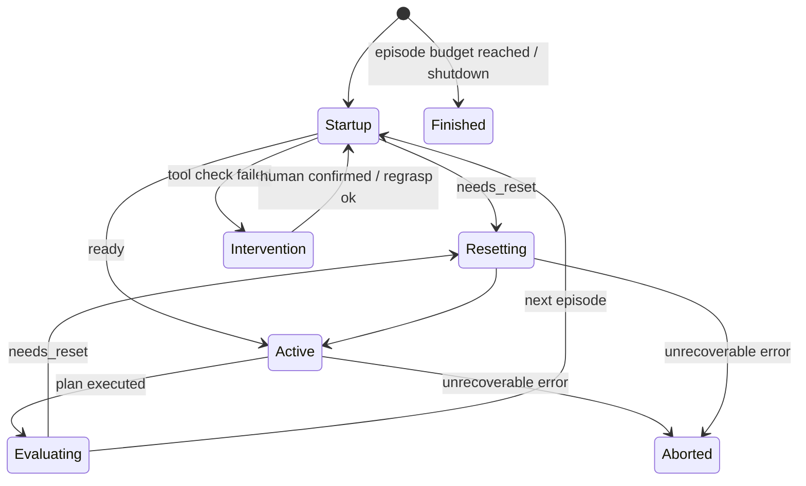

# Proposed Architecture — Perception / Planning / Execution / Session split

*Refactor target for the granular-manipulation data-collection stack. Fixes the frictions listed
in [01_current_architecture.md §5](01_current_architecture.md#5-known-defects-and-mid-refactor-debris-evidence-in-code)
while keeping the working behaviors (tool checks, cautious sweeps, action tracking, dataset
layout) intact. Doc [03](03_segmenter_native_design.md) specializes this design for a trusted
segmenter.*

## 1. Design goals

1. **Swappable planner.** The push/reset policy must be a pure, isolated object: world state in,
   plan out. Changing "random pushes" to any learned or scripted policy touches one file.
2. **One observation pipeline, one robot connection.** A single source of truth for
   images/state/frames, consumed by recorder, perception, planner, and UI alike.
3. **Explicit episode lifecycle.** Event-driven transitions with a strict ordering guarantee
   (recording is armed *before* the first order of an episode is sent), replacing the 10 Hz
   polling + `start_event` handshake.
4. **Testability without hardware.** Every robot-facing call goes through one interface with a
   dry-run implementation that type-checks and range-checks commands (this replaces "temporarily
   swap the move calls for demo functions").
5. **Separated failure policy.** Components raise typed errors; only the session layer decides
   between retry, human intervention, or abort. No `shutdown_event.set()` inside behaviors.
6. **Keep the dataset contract.** Same on-disk layout (`task/`, `restore/`, `states.json`,
   `actions.json`, `orders.json`, masks) so `extract_transitions.py` and the transition-dataset
   tooling keep working, with additive extensions only.

## 2. Layered structure

Proposed package layout (inside `autograsper/`, replacing the empty `granular_manipulation/`
skeleton; one canonical import style — package-absolute):

```
autograsper/
├── main_granular.py            # composition root (one main; variant chosen by config)
├── config_schema.py            # typed config dataclasses + validation at load
├── hardware/
│   ├── robot_interface.py      # RobotInterface protocol
│   ├── cloudgripper.py         # real impl (wraps client/cloudgripper_client.py)
│   └── dryrun.py               # DryRunRobot: validates & logs, simulates state
├── observation/
│   ├── types.py                # Observation (immutable snapshot), frame ids
│   └── source.py               # ObservationSource: the ONE polling loop + pub/sub
├── perception/
│   ├── frames.py               # CoordinateFrames: full-px ↔ crop-px ↔ robot-xy (owns homography + crop def)
│   ├── occupancy.py            # OccupancyProvider protocol
│   ├── background_diff.py      # reference-image provider (from granular_utils)
│   ├── yolo_segmenter.py       # ChickpeaSegmenter-backed provider
│   └── tool_grip.py            # tool-in-hand check (from tool_user_utils)
├── planning/
│   ├── types.py                # WorldState, Plan, Primitive dataclasses
│   ├── planner.py              # Planner protocol
│   ├── workspace.py            # fence walls, placement search (fence_utils merged here)
│   └── random_push_planner.py  # current policy, re-expressed
├── execution/
│   ├── executor.py             # Primitive → orders; timing; action tracking; safety checks
│   └── safety.py               # order validation vs. limits + mask-aware guards
├── session/
│   ├── episode.py              # EpisodeStateMachine (explicit events)
│   ├── coordinator.py          # SessionRunner: wires everything, owns failure policy
│   └── storage.py              # dataset writers (FileManager + states/actions/orders sinks)
├── recording/
│   └── recorder.py             # pure frame sink (no robot connection, no segmentation)
└── ui/
    └── stream.py               # MJPEG server, reads from ObservationSource
```

Dependency rule (arrows = "may import"): `hardware ← execution ← session → planning → perception
→ observation`; `recording` and `ui` depend only on `observation`/`session.storage`. The planner
never imports `hardware` or `execution`.

## 3. The key abstractions

### 3.1 `RobotInterface` (hardware)

```python
class RobotInterface(Protocol):
    def move_xy(self, x: float, y: float) -> CommandReceipt: ...
    def move_z(self, z: float) -> CommandReceipt: ...
    def rotate(self, angle_deg: int) -> CommandReceipt: ...
    def set_gripper(self, opening: float) -> CommandReceipt: ...
    def get_all_states(self) -> RawObservation: ...
```

- `CloudGripperRobot` wraps the existing `client/cloudgripper_client.py` — **instantiated once**,
  shared by the executor and the observation source (HTTP client is stateless, so sharing is
  safe; the point is one place for token/robot-idx/retry logic).
- `DryRunRobot` validates types and ranges (xy/z/opening in [0,1], rotation int in [0,360)),
  logs each command, advances a simulated state (position updates, monotonic timestamps), and
  can replay a directory of recorded frames as its camera. This is the permanent home for
  robot-free testing.
- **Rotation bias lives here and only here**: `CloudGripperRobot` applies `+bias` on outgoing
  `rotate` and `-bias` on reported rotation, so every layer above operates in unbiased degrees.
  (Removes the dual-site correction, defect #16.)

### 3.2 `Observation` and `ObservationSource` (observation)

Immutable snapshot replacing the mutable half of `SharedState`:

```python
@dataclass(frozen=True)
class Observation:
    seq: int                    # monotonically increasing, source-assigned
    frame_index: int | None     # recorder frame number, None when not recording
    timestamp: float
    top_image: np.ndarray
    bottom_image: np.ndarray    # undistorted + rectified (pipeline applied at source)
    robot_state: RobotState     # typed: x, y, z, rotation (bias-corrected), claw
```

`ObservationSource` runs the single FPS-paced polling loop (extracted from
`Recorder._update/record`), applies the camera pipeline (undistort + homography rectify from
`perception.frames`), and offers:

- `latest() -> Observation` — non-blocking read of the newest snapshot.
- `await_next(after_seq) -> Observation` — condition-variable wait; replaces both the
  `record_current_state` handshake and ad-hoc `time.sleep(1.5)` waits ("act, then wait for an
  observation newer than the command completion").
- `subscribe(callback)` — recorder, segmentation worker, and UI stream all consume the same
  stream; slow subscribers get latest-wins semantics (bounded queue like today's `ui_queue`).

The `ActionTracker` and `frame_index` cross-thread plumbing stays, but ownership is clarified:
the **recorder assigns frame indices** and reports them into observations; the **executor** is
the only writer of actions.

### 3.3 `WorldState`, `Plan`, `Primitive` (planning)

```python
@dataclass(frozen=True)
class WorldState:
    obs: Observation
    occupancy: OccupancyResult | None   # mask in the canonical grid frame + clump stats + staleness info
    tool: ToolStatus                    # held? grip quality? pose (from robot_state)
    workspace: Workspace                # fence walls, manipulation boundary, tool dims (static)

class Planner(Protocol):
    def plan_startup(self, w: WorldState) -> Plan: ...
    def needs_reset(self, w: WorldState) -> bool: ...
    def plan_task(self, w: WorldState) -> Plan: ...       # one episode worth of primitives
    def plan_reset(self, w: WorldState) -> Plan: ...
```

`Plan` is a list of **primitives** — semantic units, not raw orders:

| Primitive | Expands to (executor) | Notes |
|---|---|---|
| `MoveTo(x, y, z?, angle?)` | MOVE_Z/MOVE_XY/ROTATE sequence with clearance policy | ordering rules (raise before translate) live in the executor, not the planner |
| `PlaceTool(pose)` | approach + `LowerTool` | pose from placement search |
| `LowerTool(z)` | MOVE_Z with **mask-aware guard** (§3.4) | the "don't press down on granules" rule |
| `Push(start_pose, end_xy)` | planar MOVE_XY/ROTATE at grasp height | tracked as one `is_planar_2d` action ⇒ maps 1:1 to a dataset transition |
| `SweepWall(wall, mode, t_range)` | today's sweep choreography | tracked as composite `SWEEP` action with child actions (fixes #15) |
| `RegraspTool()` | scripted rack grasp | may raise `NeedsHumanHelp` |
| `RefreshMask(move_aside=bool)` | background-diff variant only | disappears in doc 03 |

The current `RandomPushGrasper` policy maps cleanly: `plan_task` = placement search + N random
pushes; `plan_reset` = per-wall band checks + sweeps; `needs_reset` = `check_reset_needed`.
All geometry helpers (`fence_utils`, placement search) move to `planning/workspace.py` and become
pure functions of `WorldState` — no robot calls, no `cv2.imwrite`, no prints (debug artifacts go
through an injected `DebugSink` that writes into the session directory when enabled).

### 3.4 `Executor` (execution)

The only component that both talks to the robot and writes actions:

- Expands primitives to orders; validates against `safety.py` limits (workspace bounds, z floor
  by region, rotation range) before sending — in dry-run mode this is exactly the requested
  "check typing and legality" behavior.
- Brackets every primitive with `ActionTracker` start/end, using frame indices from
  `ObservationSource` (`await_next` after command completion instead of a fixed sleep, when a
  precise end frame matters; falls back to the configured `time_between_orders` pacing).
- Emits `orders.json` rows through `session.storage` (append-mode JSONL — fixes the O(n²)
  rewrite, defect #13; a converter keeps the old array format for existing tooling).
- Mask-aware guard hooks: before executing `LowerTool`, ask perception for a fresh-enough
  occupancy check under the tool footprint; on failure raise `UnsafeLower` for the session layer
  to replan (today this check happens only at planning time).

### 3.5 `EpisodeStateMachine` + `SessionRunner` (session)

Replaces `DataCollectionCoordinator._monitor_state/_process_messages` and the
`run_grasping` override. Single-threaded control loop (the concurrency lives in
`ObservationSource`, recorder sink, and segmentation worker only):



Ordering guarantee that fixes the start-signal race (#8): on entering `Active`, the runner
(1) creates session dirs, (2) arms the recorder and **waits for its first frame index**,
(3) only then calls `executor.run(plan)`. Transitions are function calls in one loop — no
message queue, no polling, no missed states.

Failure policy is centralized here: typed exceptions from executor/perception
(`ToolLost`, `UnsafeLower`, `NoGranulesDetected`, `NeedsHumanHelp`, `RobotAPIError`) map to
retry / replan / intervention-wait / abort. `shutdown_event` remains only as the external
Ctrl-C/UI abort channel.

### 3.6 `Recorder` (recording) — demoted to a pure sink

Subscribes to `ObservationSource`; writes frames/states/masks for whatever directory the session
runner points it at; assigns frame indices. It no longer owns a robot connection, the camera
pipeline, segmentation, or pacing decisions (source FPS = recording FPS). `recording.py` and
`recording_seg.py` collapse into one class — segmentation is a perception worker, not a recorder
concern (see doc 03).

## 4. Config schema (typed)

`config_schema.py` loads YAML into dataclasses and fails fast with a full list of missing keys
(today: scattered `config.get(...)` with silent defaults + `KeyError`s at random depths).
Sections: `camera` (m, d, H, fps, record flags), `robot` (idx, token env var name,
rotation_bias), `experiment` (name, episode budget, N_pushes, timings), `workspace` (fence
center/size, manipulation boundary in robot & grid frames, tool dims in both frames, homography
path), `perception` (provider = `background_diff` | `yolo`, provider-specific params, crop
definition, freshness policy), `tool_check` (ROI, thresholds, color ranges), `ui`, `storage`.
The crop definition and tool dimensions appear **once**, inside `perception.frames` /
`workspace`, eliminating the two-competing-crops bug (#10).

## 5. Migration map (old → new)

| Current code | Destination |
|---|---|
| `main_chickpeas*.py` | `main_granular.py` (variant via `perception.provider` config) |
| `coordinator.py::DataCollectionCoordinator` | `session/coordinator.py` + `session/episode.py` |
| `coordinator.py::SharedState` | `observation/types.py` (immutable) + explicit wiring |
| `recording.py::Recorder._update` + camera math | `observation/source.py` + `perception/frames.py` |
| `recording.py::Recorder` (disk part) | `recording/recorder.py` + `session/storage.py` |
| `recording_seg.py::SegmentationThread` | `perception/yolo_segmenter.py` worker (doc 03) |
| `grasper.py::AutograsperBase.queue_orders/execute_order` | `execution/executor.py` |
| `grasper.py` state machine + `start_event` | `session/episode.py` (events, not polling) |
| `custom_graspers/granular_pusher.py::RandomPushGrasper` | `planning/random_push_planner.py` (decisions) + primitives in `execution` (motion) + `perception/tool_grip.py` (checks) |
| `custom_graspers/fence_utils.py` | `planning/workspace.py` (+ `perception/frames.py` for `PixelRobotTransform`) |
| `object_tracker/granular_utils.py` | `perception/background_diff.py` + `planning` reset heuristics |
| `action_tracker.py` | kept; gains composite (parent/child) actions |
| `file_manager.py` | `session/storage.py` |
| `library/utils.py::execute_order/OrderType` | `execution/executor.py` + `hardware/robot_interface.py` |

Suggested migration order (each step leaves the system runnable):
1. `hardware/` + `DryRunRobot`; route existing code's robot calls through it.
2. `observation/source.py` extracted from the recorder; `SharedState` becomes a thin adapter.
3. `execution/executor.py` replacing `queue_orders`; append-mode order/state sinks.
4. `session/` state machine replacing coordinator queues (fixes the race first — it's the one
   that corrupts data).
5. `planning/` extraction of `RandomPushGrasper`; delete the `run_grasping` override.
6. Perception providers; then doc 03's segmenter-native changes.

## 6. What deliberately does not change

- CloudGripper HTTP client (`client/cloudgripper_client.py`) — wrapped, not rewritten.
- Dataset directory layout and file names (extensions are additive; `states.json`/`orders.json`
  gain JSONL siblings first, with the array files produced at episode end instead of per frame).
- The cautious behaviors themselves (tool-grip verification, human-assisted regrasp, staged
  wall-sweep fallback) — they encode real hardware lessons and are ported as primitives, not
  redesigned.
- Flask MJPEG debugging UI.
